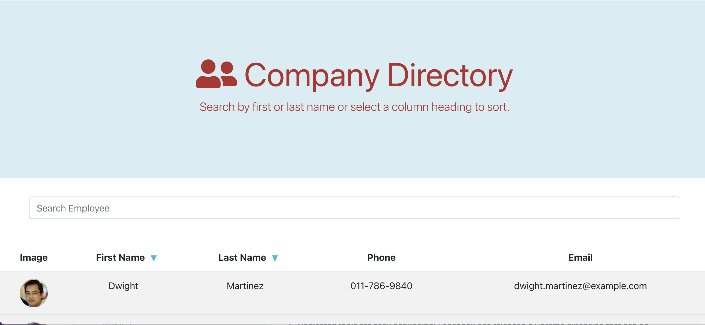

## Table of Contents

- [Description](#description)
- [Installation](#installation)
- [Technologies Used](#technologies)
- [Link](#link)

## Description

This project creates a React web application that allows the user to visualize Employees details, search by keyword and filter results.

## Installation

The following steps were undertaken to create this program

- Create and download the repository in gitHub
- Open VS Code

  - Execut Create React App: Run npx create-react-app <appname>

- React downloads many dependencies. Download the following dependencies

  - Axios
  - gh-pages

- 'npm start' in the command line

## Technologies

- Javascript
- HTML
- CSS
- Bootstrap
- React.js

## Link

You can see the link of this app [LINK](https://10-kp.github.io/employee_directory/)

[GITHUB](https://github.com/10-kp/employee_directory)
